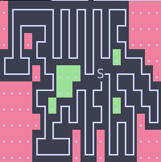
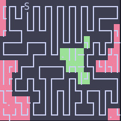
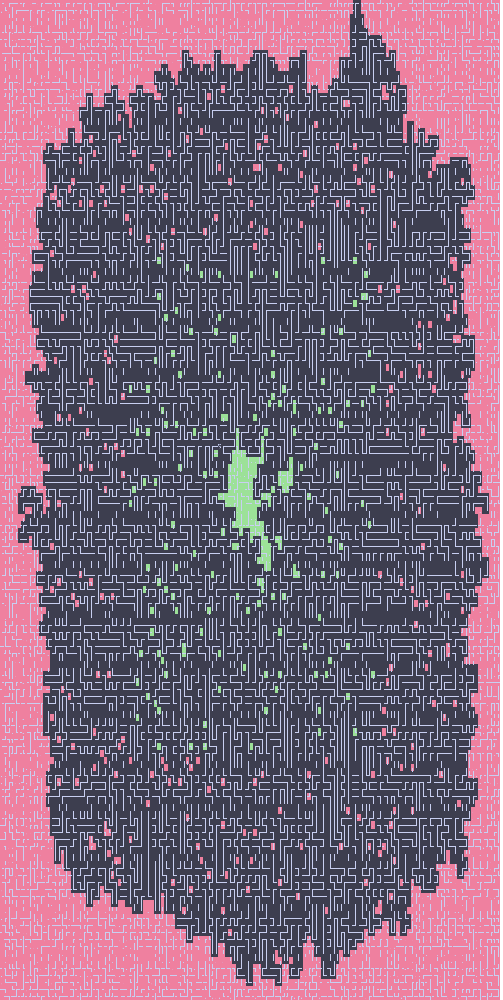

# log

## 2023 day 10

This was definitely the hardest day for me so far, especially part 2.
These visualizations were very helpful in understanding the problem:

In these images, green background means it is enclosed in the pipeline, red means it is not.
The pipeline itself has a black background.

This example input ...

```
.F----7F7F7F7F-7....
.|F--7||||||||FJ....
.||.FJ||||||||L7....
FJL7L7LJLJ||LJ.L-7..
L--J.L7...LJS7F-7L7.
....F-J..F7FJ|L7L7L7
....L7.F7||L7|.L7L7|
.....|FJLJ|FJ|F7|.LJ
....FJL-7.||.||||...
....L---J.LJ.LJLJ...
```

.. resulted in



And this one ...

```
FF7FSF7F7F7F7F7F---7
L|LJ||||||||||||F--J
FL-7LJLJ||||||LJL-77
F--JF--7||LJLJ7F7FJ-
L---JF-JLJ.||-FJLJJ7
|F|F-JF---7F7-L7L|7|
|FFJF7L7F-JF7|JL---7
7-L-JL7||F7|L7F-7F7|
L.L7LFJ|||||FJL7||LJ
L7JLJL-JLJLJL--JLJ.L
```

.. resulted in



It's not allowed to post your full input online, but I think this visualization is transformative enough to constitute fair use.

The screenshot is very large, so you can either
<details><summary>expand it in this markdown file,</summary><p>

</p></details>

or [check out](assets/day10-full.png) the png file itself.

The source code for these visualizations is in the solution script for day 10 itself.
